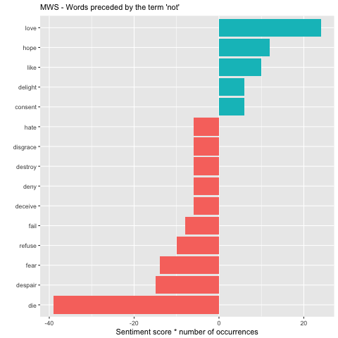

# Spring2018
# Project 1: SPOOKY text analysis

----

### Project Description
This is the first and only *individual* (as opposed to *team*) this semester. 

Term: Spring 2018

+ Project title: An R Notebook Data Story on Horror Stories
+ This project is conducted by Ayano Kase, UNI: ak3687
+ Project summary: This project conducts a textual analysis of three writers, Edgar Allen Poe, HP Lovecraft, and Mary Shelly in order to gain insight into their writing styles. Specifically, I conducted analysis on their punctuation styles, word frequency (basic, bigram), and negative sentiments. 

### What kinds of words do each author use?

Looking at word frequencies are a good way to spotting unique characteristics of each author's text. In order to measure frequency, I used tf-idf, which is an index to indicate how frequently a certian author uses a word relative to the frequency of all the other authors. The below graph presents the top 15 frequent words for each author. 

We can see that the words listed are mostly character names. Now,  we want to take this analysis one step further to gain better insight into the writing chracteristics of each author. Instead of looking at single words, the following analysis extracts frequencies of pairs of words by utilizign the bigram method and similarly tf-idf. 

The below graph presents the top 10 frequent pairs for each author. 

From the above graph, we can observe the following:

+ EAP can be identified by the use of "ha ha" and HPL by "heh heh"
+ EAP seems to use a lot of french fixed nouns, suggesting that many of his stories are based in France
+ HPL is famous for using made-up words- we can see that in words like "yog sothoth" and "hatheg ida"
+ The most frequent pair for MWS is Lord Raymond, an unsurprising result since it is the character in her novel The Last Man
+ MWS is the only British author-- her frequent use of "windsor castle" is a good indication

Network plots can help us to visualize better the relationship between the words. 

+ In addition to the above observations, EAP tends to repeat the same words a lot (ex. Ha ha, ugh ugh, hu hu)

+ "Dr. Armitage", "Dr. Halsey" and "Dr. Johnson" are obvious tips for identifying HPL's writing

+ Seems to lack in terms of inventive words as compared to the other two authors

As we can see from the above observations, extracting words in pairs rather than one is an effective way to capture the unique characteristics of the author's writing, because 1) it helps us capture fixed nouns that are an easy tool to identify authors, and 2) observe quirks in writing such as repetition and made-up words. 

### How does each author create a sentence?
While there are many ways to analyze sentence structures, one way of understanding them is through punctuations. Here, I analyzed the frequency of five different types of punctuation marks for each author. 

The graph points us to interesting observations:

+ EAP uses the most punctuation marks in total, while HPL uses the least
+ The large number of commas used by EAP seems to suggest his long sentences
+ EAP and MWS uses a fair amount of quotation marks while HPL does not, which indicate that HPL does not incorporate a lot of dialogue
+ MWS seems to love using semi-colons

Although we do have to be careful when looking at total numbers because the overall word count for each author might be different. Indeed, EAP's word count is about 10,000 words more than the other two. However, given that the word count for HPL and MWS are about the same, this analysis still produces useful observations.

### How negative is each author? (After all, they are horror story writers)
The last type of analysis is a sentiment analysis. There is a specific lexicon that we can use to match words with different sentiments. Here, we only focus on words with negative sentiments. 

Below is a graph of frequency comparison of negative words. 

While they all use a fair amount of negative words in total, there are variations in word choices that are interesting to take a look at. For example, 
+ EAP uses the words "doubt", "fell", "immediately" a lot more frequently than the other two
+ HPL uses the words "ancient", "stone", "hideous" a lot more frequently than the other two
+ MWS uses the words "lost", "despair", "misery" a lot more frequently than the other two

In order to delve a little further into this analysis, I also looked at negated negatives, which are words like "not good" that won't be picked up by the previous sentiment analysis. The four graphs plot the [sentiment score*number of occurrences] for words preceded by the term "not" for all authors and individual authors. 

Here, we can clearly see that HPL is the most negative out of the three authors for his abundant uses of word pairs like "not like". 

